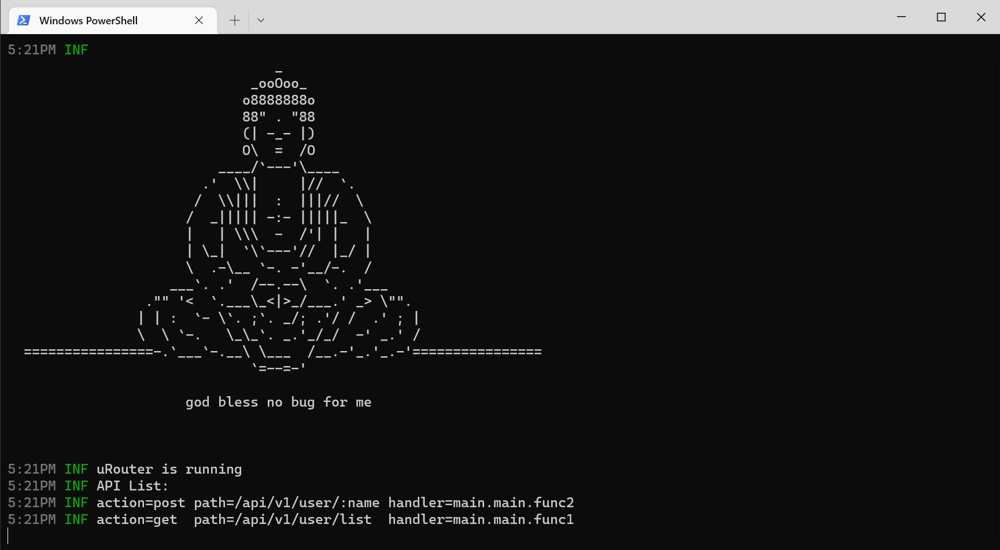
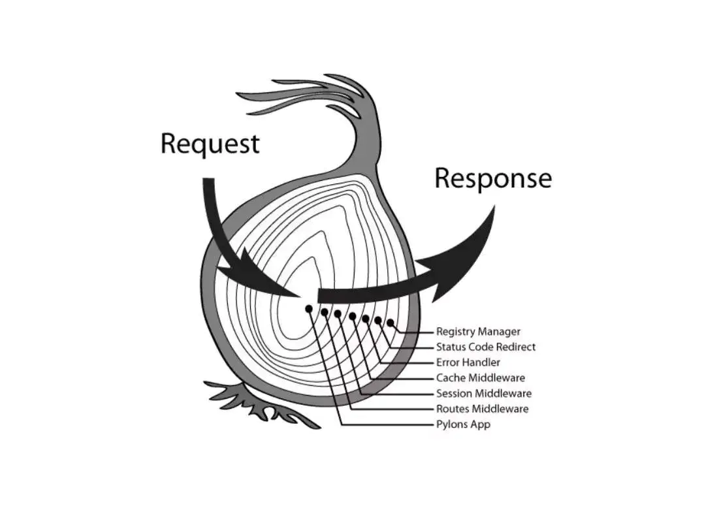

# uRouter

universal router for http, websocket and custom protocol, one is all.

Hats off to express, koa, gin!

[![Build Status][1]][2] [![MIT licensed][3]][4] [![Go Version][5]][6] [![codecov][7]][8] [![Go Report Card][9]][10]

[1]: https://github.com/lxzan/uRouter/workflows/Go%20Test/badge.svg?branch=main

[2]: https://github.com/lxzan/uRouter/actions?query=branch%3Amain

[3]: https://img.shields.io/badge/license-MIT-blue.svg

[4]: LICENSE

[5]: https://img.shields.io/badge/go-%3E%3D1.16-30dff3?style=flat-square&logo=go

[6]: https://github.com/lxzan/uRouter

[7]: https://codecov.io/gh/lxzan/uRouter/branch/main/graph/badge.svg?token=0Tx9xH9Lvd

[8]: https://codecov.io/gh/lxzan/uRouter

[9]: https://goreportcard.com/badge/github.com/lxzan/uRouter

[10]: https://goreportcard.com/report/github.com/lxzan/uRouter

#### Feature

- amazing 100% branch coverage for unit tests
- no dependence
- dynamic separation matching request paths, powered by map and trie
- the onion model middleware, router group
- adapt to `http`, `http2`, `http3`, `lxzan/gws`, `gorilla/websocket` ...

#### Index

- [uRouter](#urouter)
  - [Feature](#feature)
  - [Index](#index)
  - [Quick Start](#quick-start)
  - [WebSocket](#websocket)
  - [Middleware](#middleware)
  - [Codec](#codec)
  - [Benchmark](#benchmark)

#### Quick Start

```go
package main

import (
	"github.com/lxzan/uRouter"
	httpAdapter "github.com/lxzan/uRouter/contrib/adapter/http"
	"github.com/lxzan/uRouter/contrib/codec/jsoniter"
	"github.com/lxzan/uRouter/contrib/log/zerolog"
	"net/http"
)

func init() {
	uRouter.SetJsonCodec(jsoniter.JsoniterCodec)
	uRouter.SetLogger(zerolog.ZeroLogger)
}

func main() {
	var router = uRouter.New()
	router.Use(uRouter.Recovery(), uRouter.AccessLog())
	var group = router.Group("/api/v1")

	group.OnGET("/user/list", func(ctx *uRouter.Context) {
		_ = ctx.WriteJSON(http.StatusOK, []string{"ming", "hong"})
	})

	group.OnPOST("/user/:name", func(ctx *uRouter.Context) {
		_ = ctx.WriteJSON(http.StatusOK, uRouter.Any{
			"hello": ctx.Param("name"),
		})
	})

	router.Start()
	if err := http.ListenAndServe(":3000", httpAdapter.NewAdapter(router)); err != nil {
		uRouter.Logger().Panic(err.Error())
	}
}
```

- Output



#### WebSocket

- server

```go
package main

import (
	"github.com/lxzan/gws"
	"github.com/lxzan/uRouter"
	gwsAdapter "github.com/lxzan/uRouter/contrib/adapter/gws"
	httpAdapter "github.com/lxzan/uRouter/contrib/adapter/http"
	"github.com/lxzan/uRouter/contrib/codec/jsoniter"
	"github.com/lxzan/uRouter/contrib/log/zerolog"
	"net/http"
)

func init() {
	uRouter.SetLogger(zerolog.ZeroLogger)
	uRouter.SetJsonCodec(jsoniter.JsoniterCodec)
}

func main() {
	router := uRouter.New()
	router.Use(uRouter.Recovery(), uRouter.AccessLog())

	upgrader := gws.NewUpgrader(func(c *gws.Upgrader) {
		c.EventHandler = &WebSocketHandler{adapter: gwsAdapter.NewAdapter(router)}
	})

	router.OnGET("/connect", func(ctx *uRouter.Context) {
		socket, err := upgrader.Accept(ctx.Writer.Raw().(http.ResponseWriter), ctx.Request.Raw.(*http.Request))
		if err != nil {
			uRouter.Logger().Error(err.Error())
			return
		}
		go socket.Listen()
	})

	router.On("/greet", func(ctx *uRouter.Context) {
		ctx.Writer.Header().Set("content-type", "plain/text")
		_ = ctx.WriteString(int(gws.OpcodeText), "hello!")
	})

	router.Start()
	if err := http.ListenAndServe(":3000", httpAdapter.NewAdapter(router)); err != nil {
		uRouter.Logger().Panic(err.Error())
	}
}

type WebSocketHandler struct {
	gws.BuiltinEventEngine
	adapter *gwsAdapter.Adapter
}

func (c *WebSocketHandler) OnMessage(socket *gws.Conn, message *gws.Message) {
	if err := c.adapter.ServeWebSocket(socket, message); err != nil {
		uRouter.Logger().Error(err.Error())
	}
}

```

- client

```js
let ws = new WebSocket('ws://127.0.0.1:3000/connect');
ws.send('0033{"U-Path":"/greet","U-Action":""}{"hello":"world!"}');
```

#### Middleware



```go
package main

import (
	"fmt"
	"github.com/lxzan/uRouter"
	http2 "github.com/lxzan/uRouter/contrib/adapter/http"
	"net/http"
)

func main() {
	var router = uRouter.New()

	var list []int
	router.Use(func(ctx *uRouter.Context) {
		list = append(list, 1)
		ctx.Next()
		list = append(list, 2)
		fmt.Printf("%v\n", list)
	})

	var group = router.Group("/api/v1", func(ctx *uRouter.Context) {
		list = append(list, 3)
		ctx.Next()
		list = append(list, 4)
	})

	group.OnGET("/greet", func(ctx *uRouter.Context) {
		list = append(list, 5)
	})

	router.Start()
	_ = http.ListenAndServe(":3000", http2.NewAdapter(router))
}
```

```
output: 1, 3, 5, 4, 2
```

#### Codec

- WWW Form Codec

```go
type Input struct {
	Name string `form:"name"`
	Age  int    `form:"age"`
}

func (c *Controller) Test(ctx *uRouter.Context) {
	defer ctx.Request.Close()
	var input = &Input{}
	_ = wwwform.FormCodec.NewDecoder(ctx.Request.Body).Decode(input)
	
	fmt.Printf("%v\n", input)
	_ = ctx.WriteString(http.StatusOK, "success")
}
```

- JSON Codec

```go
import (
    "github.com/lxzan/uRouter"
    "github.com/lxzan/uRouter/contrib/codec/jsoniter"
)

func init() {
    // Better performance than uRouter.StdJsonCodec 
    uRouter.SetJsonCodec(jsoniter.JsoniterCodec)
}

type Input struct {
    Name string `form:"name"`
    Age  int    `form:"age"`
}

func (c *Controller) Test(ctx *uRouter.Context) {
    defer ctx.Request.Close()
    var input = &Input{}
    _ = uRouter.JsonCodec().NewDecoder(ctx.Request.Body).Decode(input)

    fmt.Printf("%v\n", input)
    _ = ctx.WriteString(http.StatusOK, "success")
}
```

- Header Codec (Not applicable to HTTP)

```
uRouter.TextMapHeader:   length_encoding=4 byte, max_header_length=9999  byte
uRouter.BinaryMapHeader: length_encoding=2 byte, max_header_length=65535 byte
```

```
// TextMapHeader Example
// header length => header payload => body
0033{"U-Path":"/greet","U-Action":""}{"hello":"world!"}
```

#### Benchmark

##### RPS

- `uRouter`

```
wrk -t2 -c100 -d10s 'http://127.0.0.1:3000/api/v1/test'
Running 10s test @ http://127.0.0.1:3000/api/v1/test
  2 threads and 100 connections
  Thread Stats   Avg      Stdev     Max   +/- Stdev
    Latency     1.10ms    1.91ms  29.86ms   89.53%
    Req/Sec    93.14k     6.95k  103.45k    73.50%
  1852591 requests in 10.00s, 210.25MB read
Requests/sec: 185213.28
Transfer/sec:     21.02MB
```

- bare `net/http`

```
wrk -t2 -c100 -d10s 'http://127.0.0.1:3001/api/v1/test'
Running 10s test @ http://127.0.0.1:3001/api/v1/test
  2 threads and 100 connections
  Thread Stats   Avg      Stdev     Max   +/- Stdev
    Latency     1.09ms    2.07ms  42.90ms   90.58%
    Req/Sec    98.12k     6.96k  107.20k    70.79%
  1971473 requests in 10.10s, 223.74MB read
Requests/sec: 195157.71
Transfer/sec:     22.15MB
```

#### Route Algorithm

- `uRouter`

```
goos: darwin
goarch: arm64
pkg: github.com/lxzan/uRouter
BenchmarkOneRoute-8             	77647704	        13.53 ns/op	       0 B/op	       0 allocs/op
BenchmarkOneRouteDynamic-8      	34728837	        34.69 ns/op	       0 B/op	       0 allocs/op
BenchmarkRecoveryMiddleware-8   	70822222	        16.99 ns/op	       0 B/op	       0 allocs/op
Benchmark5Params-8              	15952770	        73.23 ns/op	       0 B/op	       0 allocs/op
BenchmarkOneRouteJSON-8         	89840808	        13.39 ns/op	       0 B/op	       0 allocs/op
Benchmark404-8                  	81540667	        14.89 ns/op	       0 B/op	       0 allocs/op
Benchmark404Many-8              	35411809	        34.11 ns/op	       0 B/op	       0 allocs/op
PASS
```

```
goos: darwin
goarch: arm64
pkg: github.com/gin-gonic/gin
BenchmarkOneRoute-8             	45460980	        26.13 ns/op	       0 B/op	       0 allocs/op
BenchmarkRecoveryMiddleware-8   	38337534	        31.00 ns/op	       0 B/op	       0 allocs/op
Benchmark5Params-8              	18889320	        63.42 ns/op	       0 B/op	       0 allocs/op
BenchmarkOneRouteJSON-8         	 7542141	       162.7 ns/op	      48 B/op	       3 allocs/op
Benchmark404-8                  	29467527	        43.23 ns/op	       0 B/op	       0 allocs/op
Benchmark404Many-8              	27458932	        43.92 ns/op	       0 B/op	       0 allocs/op
PASS
```
